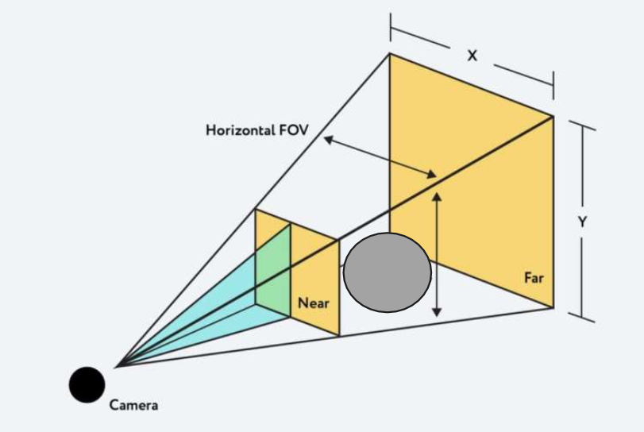

<!-- _class: title -->

# WebGL & Three.js

Sangmin Do
Madapp
2023-01-11

---

# WebGL(Web Graphics Library)

- JavaScript API for 2D / 3Dasdfasdf
- No plug-ins
- HTML5 `<canvas>`
- OpenGL ES 2.0

---

# Three.js

Powerful JavaScript 3D library
Animated 3D graphics
WebGL which allows for access to GPU

---

# Usage

We can place an object, define a camera, light the scene and Three.js renders 3D image.

---

# Simple usage

```html
<!DOCTYPE html>
<html>
  <head>
    <meta charset="utf-8" />
    <title>My first three.js app</title>
    <style>
      body {
        margin: 0;
      }
    </style>
  </head>
  <body>
    <script src="js/three.js"></script>
    <script>
      // Our Javascript will go here.as
    </script>
  </body>
</html>
```

---

# Fundamentals of three.js

<div class="twocols">

- Renderer
- Scene
- Camera
- Mesh
- Geometry
- Material
- Texture
- Light

<p class="break"></p>


</div>

---

# Renderer

- The main object of three.js.
- You pass a Scene and a Camera to a Renderer, and it renders (draws) the portion of the 3D scene that is inside the frustum of the camera as a 2D image to a canvas.

---

# Scene

- A scene is set in coordinate system (X, Y, Z)
- Place object in the scene, such as cubes, cars, etc.

```javascript
const scene = new THREE.Scene();
```

---

# Camera(1/2)

- A camera is your view port to look at the objects in a scene.

```javascript
const fov = 75; // field of view(시야각)
const aspect = 2; // the canvas default (캔버스 가로 세로 비율)
const near = 0.1;
const far = 5;
const camera = new THREE.PerspectiveCamera(fov, aspect, near, far);
```

---

# Camera(2/2)



---

# Mesh

- Mesh objects represent drawing a specific Geometry with a specific Material.

---

# Geometry

- Geometry objects represent the vertex data of some piece of geometry like a sphere, cube, plane, dog, human, building, etc.

---

# Material

- Material is used to apply texture and color to an object.
- Surface properties used to draw geometry including things like the color to use and how shiny it is.
- A Material can also reference one or more Texture objects.

```javascript
const material = new THREE.MeshStandardMaterial({
  color: new THREE.Color("rgb(0, 150,140)"),
  wireframe: thre,
});

const mesh = new THREE.mesh(geometry, material);
```

---

# Texture

- Images either loaded from image files, generated from a canvas or rendered from another scene.

---

# Lights

- Light objects represent different kinds of lights.
- The scene needs to be lit to be visible.

```javascript
// create a point light
var ptLight = new THREE.PointLight(0xffffff);

// set its position
ptLight.position.x = 10;
ptLight.position.y = 50;
ptLight.position.z = 120;

// add to the scene
scene.add(ptLight);
```
