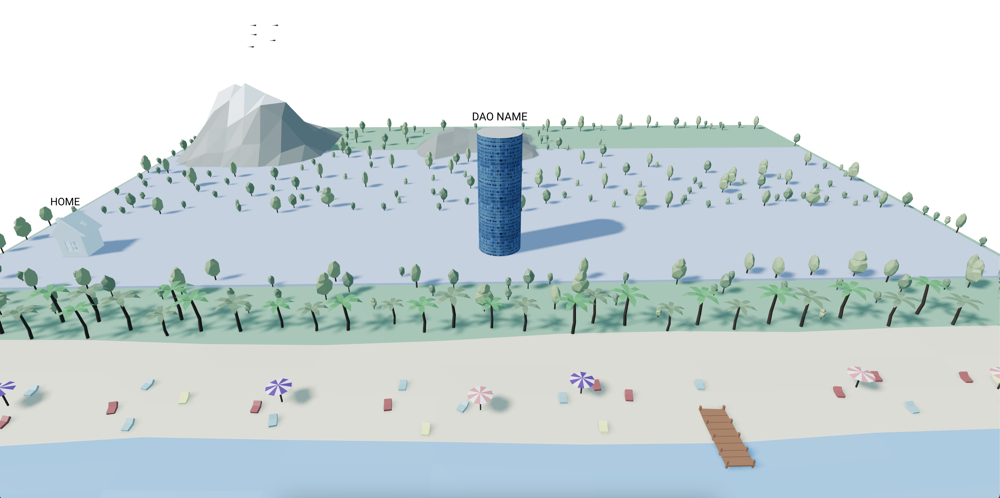
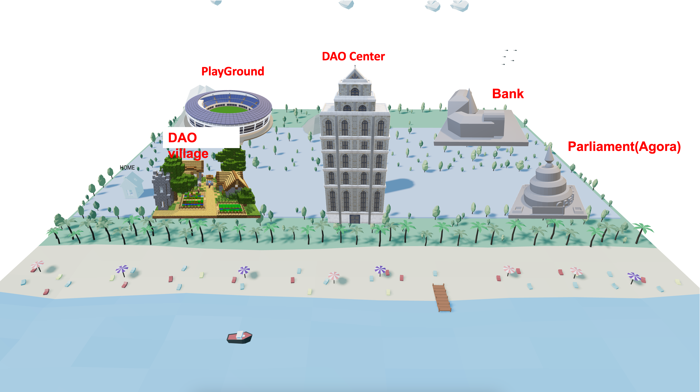
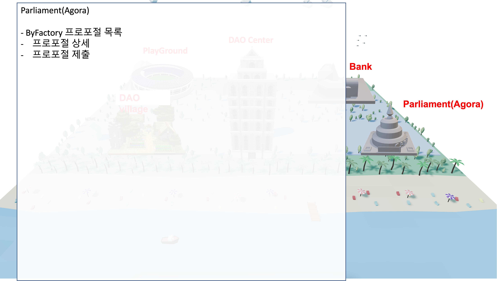
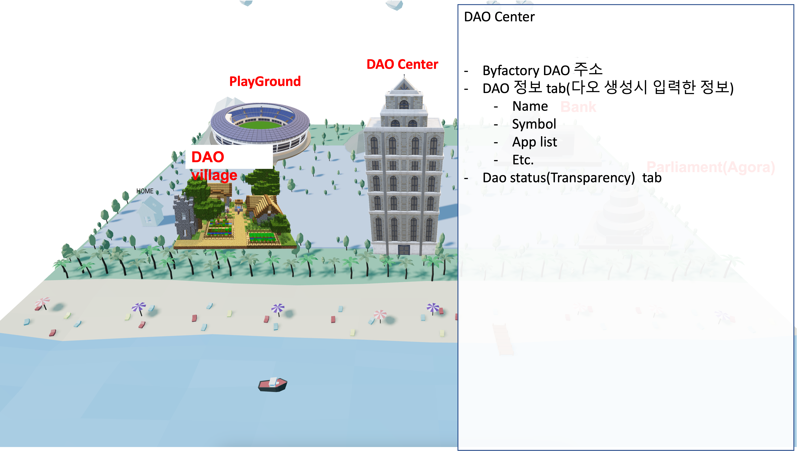
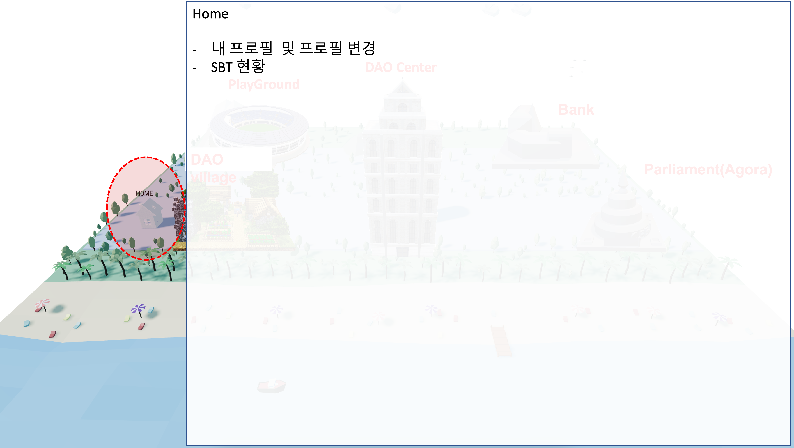
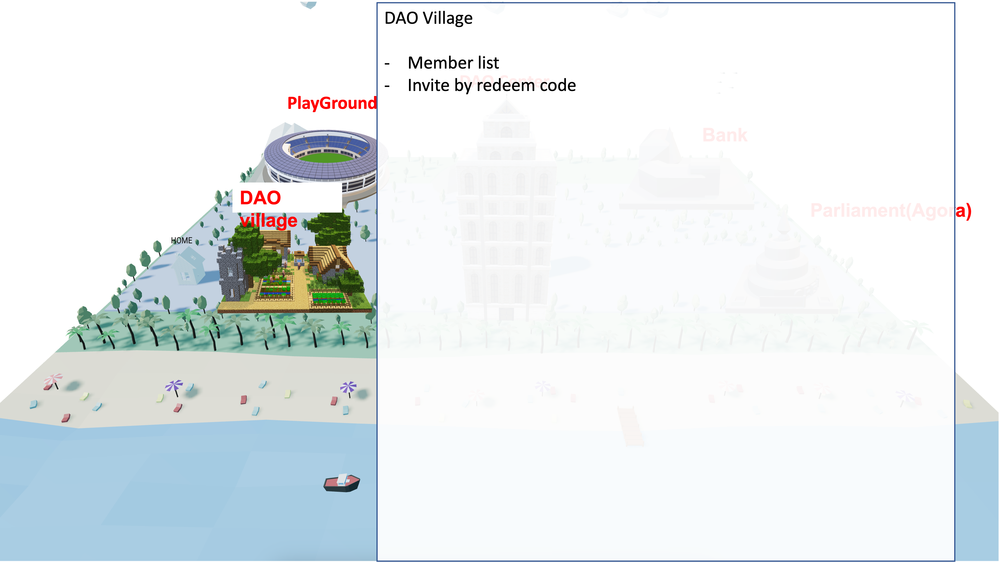
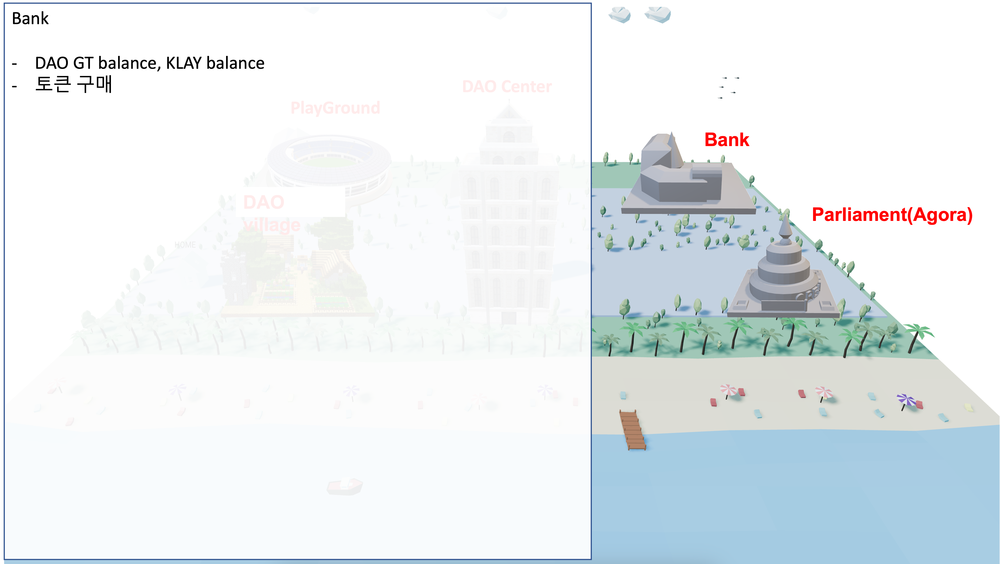
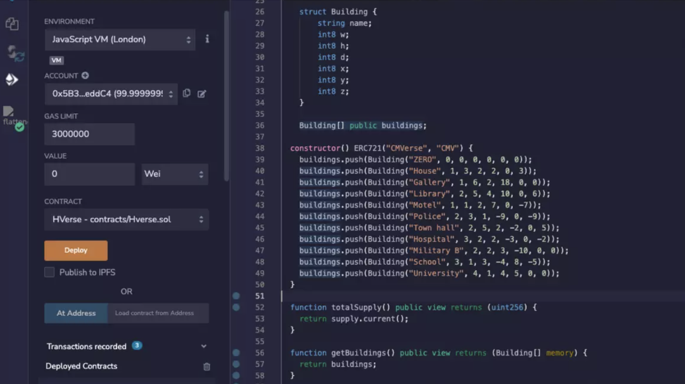
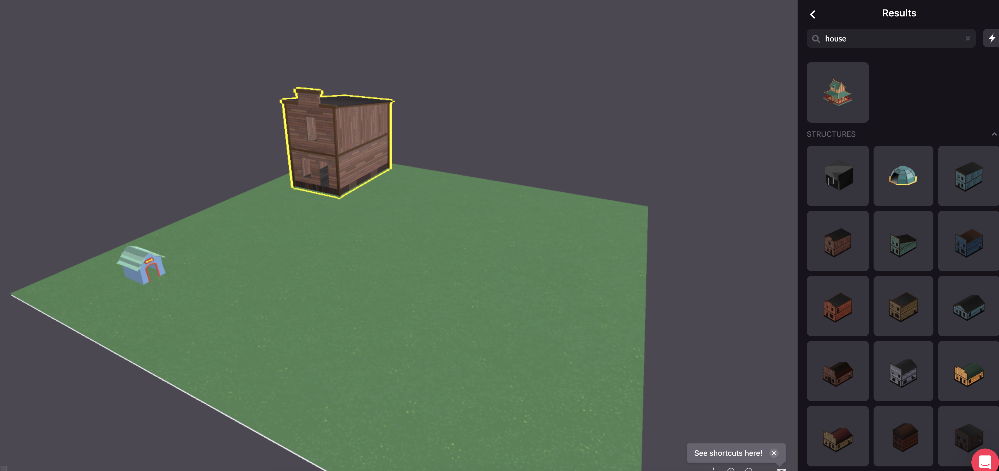
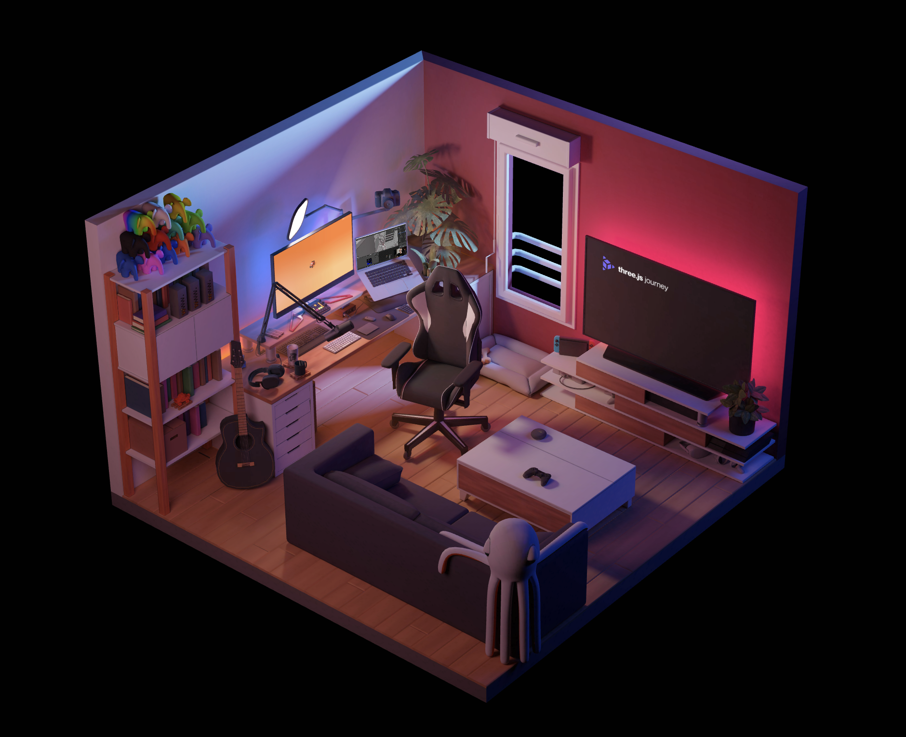

<!-- _class: title -->

# Byfactory 메타버스 기획

Sangmin Do
Madapp
March 16, 2023

---

# Current state

---

# 1st step - Main page(1/2)

## Main page 기본 구성요소 개발

- Low poly model
- No DAO metaverse contract  
- WebGL with React  
  

- extension 기능들의 조합으로 빌딩 모델링 (또는 구매)
- 현재 ByFactory 처럼 유사한 기능을들 조합해서 건물로 표현
  - bank, StandardToken 은행 건물
  - Profile, 닉네임 변경 내 SBT 조회 등을 묶어 Home 건물
- 각 건물 클릭시 Zoom 및 각 건물의 상태를 보여줌

---

# 1st step - Main page(2/2)

---

# Main 페이지 - Parliament

---

# Main 페이지 - DAO Center

---

# Main 페이지 - Home

---

# Main 페이지 - Village

---

# Main 페이지 - Bank

---

# 2nd step - Metaverse contract(1/2)

## 스마트 컨트랙트 및 사용자 에디터 개발

- 사용자가 main 페이지의 건물들을 원하는 위치로 변경
- 이를 위해 건물들 좌표값 및 수정 권한 등의 정보를 컨트랙트에 저장할 필요가 있음
- 또한, Client의 static webGL이 아닌 추가적인 building editor 필요

---

# 2nd step - Metaverse contract(2/2)

- DAO metaverse contract  

  

- Unity engine glTF building builder

  - [decentraland builder github](https://github.com/decentraland/builder)
  - [decentraland builder](https://builder.decentraland.org/scenes)

---

# 3rd step - Additional 3D components at main page

## 3D web 디테일 추가

- Home 클릭시 을 Bondee와 유사한 MyRoom 공간 표현 및 Home 꾸미기
- Village에서 멤버들의 MyRoom 확인 기능
- DAO center에서 층별로 정보를 나눠서 보여주기 등
- 이외에도 건물 내부를 투사하여 보여주거나 사용자들의 관심을 끌만한 3D 요소 추가

---

# 4th step - Muliplayer network

## 사용자간 가상현실에서 자유롭게 토론하는 공간을 생성

- Agora 메타버스 공간 생성
- 멀티플레이어 인프라 구성
- 사용자간 음성, 채팅 기능
- 메타버스상에서의 Proposal / Vote / Comment 기능
