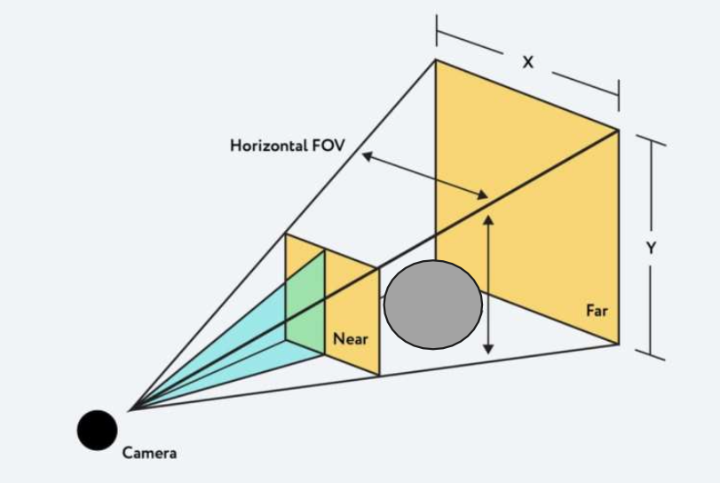

<!-- _class: title -->

# WebGL & Three.js

Sangmin Do
Madapp
2023-01-11

---

# WebGL(Web Graphics Library)

- JavaScript API for 2D / 3D
- HTML5 `<canvas>`
- No plug-ins
- OpenGL ES 2.0
- Library for WebGL `Three.js`, `Babylon.js` ...

---

# WebGL Browser support


---

# WebGL 2.0 Browser support


---

# Three.js


- cross-browser JavaScript library for 3D
- create and display animated 3D computer graphics in a web browser using WebGL
- [three.js](https://threejs.org/)

---

# Usage

We can

- place an object,
- define a camera,light the scene and Three.js renders 3D image.

---

# Simple usage

```html
<!DOCTYPE html>
<html>
  <head>
    <meta charset="utf-8" />
    <title>My first three.js app</title>
    <style>
      body {
        margin: 0;
      }
    </style>
  </head>
  <body>
    <script src="js/three.js"></script>
    <script>
      // Our Javascript will go here.as
    </script>
  </body>
</html>
```

---

# Fundamentals of three.js

<div class="twocols">

- Renderer
- Scene
- Camera
- Mesh
- Geometry
- Material
- Texture
- Light

<p class="break"></p>


</div>

---

# Renderer

- Three.js 의 핵심 개체
- `Scene`과 `Camera` 객체를 넘겨 받아 카메라의 절두체(frustum) 안 3D 씬의 일부를 평면(2차원) 이미지로 렌더링

---

# Scene

- 화면을 구성하는 물체(Object)와 광원(Light)를 좌표로 저장하고 관리
- 물체와 광원을 생성한 뒤, 해당 객체를 Scene 객체에 포함시켜서 화면에 나타내게 함

```javascript
let scene = new THREE.Scene();
scene.add(cube);
scene.add(ambienLight);
```

---

# Camera(1/2)

- A camera is your view port to look at the objects in a scene.
- 객체를 활영하여 어떻게 보여줄것인가를 결정
- 같은 Scene이라도 카메라 위치 및 설정값들에 따라 다른 화면을 보여줄 수 있음

```javascript
const fov = 75; // field of view(시야각)
const aspect = 2; // the canvas default (캔버스 가로 세로 비율)
const near = 0.1;
const far = 5;
const camera = new THREE.PerspectiveCamera(fov, aspect, near, far);
```

---

# Camera(2/2)



---

# Mesh

- `Geometry`와 `Material`로 만들어진 3D 화면을 구성하는 물체(Object)
- 설정값을 통해서 3D 공간상의 위치와 자세를 결정할 수 있다.

```javascript
let cubeGeometry = new THREE.BoxGeometry(10, 10, 10);
let cubeMaterial = new THREE.MeshLambertMaterial({ color: 0xFFDFFA });
let cube = new THREE.Mesh(cubeGeometry, cubeMaterial);
cube.position.set(1, 2, 0);
```

---

# Geometry

- 기하학 객체의 정점 데이터
- 구(sphere), 정육면체(cube), 면(plane), 개, 고양이, 사람, 나무, 건물 등
- built-in Geometry 객체 제공

---

# Material

- 기하학 객체를 그리는데 사용하는 표면 속성
- 색, 밝기 등 설정
- 하나의 `Material`은 여러개의 `Texture`를 사용 가능
- 주로 기하학 객체 표면을 이미지로 덮어씌울때 주로 사용

```javascript
const material = new THREE.MeshStandardMaterial({
  color: new THREE.Color("rgb(0, 150,140)"),
  wireframe: true,
});

const mesh = new THREE.mesh(geometry, material);
```

---

# Texture

- 이미지, 파일에서 로드한 이미지, `canvas`로 생성한 이밎, 다른 scene 객체에서 렌더링한 결과물

---

# Lights

- 주변광(AmbientLight), 집중광(SpotLight) 등 여러 종류의 광원

```javascript
// create a point light
var ptLight = new THREE.PointLight(0xffffff);

// set its position
ptLight.position.x = 10;
ptLight.position.y = 50;
ptLight.position.z = 120;

// add to the scene
scene.add(ptLight);
```

---

# examples
