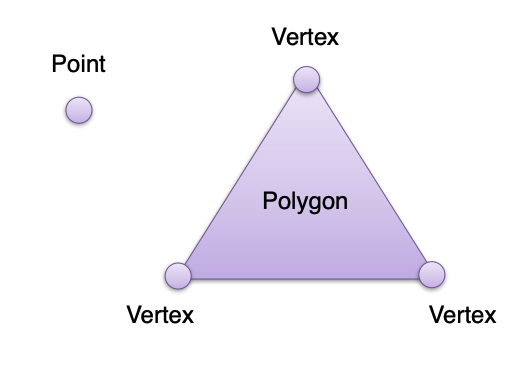
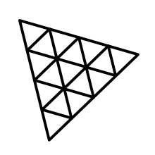

<!-- _class: title -->

# WebGL & Three.js

Sangmin Do
Madapp
January 11, 2023

---

# WebGL(Web Graphics Library)

- JavaScript API for 2D / 3D
- HTML5 `<canvas>`
- No plug-ins
- OpenGL ES 2.0
- GLSL(OpenGL Shading Language, OpenGL 셰이딩 언어)
- Library for WebGL `Three.js`, `Babylon.js` ...

---

# WebGL basic concept

<div class="twocols">

- Vertex(정점)
  - 정점의 정보를 가지고 있는 자료구조
- Polygon(폐곡선)
  - vertex를 연결해서 만든 면
- Mesh
  - polygon + vertex 집합
- Vertex Shader
  - 정점에서 호출되는 쉐이더. 정점 변환, 좌표 생성 및 변환 등에 적용
- Rasterization(레스터화)
  - Fragment Shader에서 처리 가능한 정보로 바꾸는 과정
- Fragment Shader
  - vertext shader, rasterizer 를 거친 데이터를 통해 각 픽셀의 값을 결정
  - 픽셀값, 안개, texture 등 연산



</div>

---

# Rendering pipeline

<div style="text-align:center">
  
</div>

---

# WebGL Browser support


---

# WebGL 2.0 Browser support


---

# Three.js



- cross-browser JavaScript library for 3D
- create and display animated 3D computer graphics in a web browser using WebGL
- [three.js](https://threejs.org/)

---

# Usage

We can

- Place an object,
- define a camera, light the scene and Three.js renders 3D image.


---

# Simple usage

```html
<!DOCTYPE html>
<html>
  <head>
    <meta charset="utf-8" />
    <title>My first three.js app</title>
    <style>
      body {
        margin: 0;
      }
    </style>
  </head>
  <body>
    <script src="js/three.js"></script>
    <script>
      // Our Javascript will go here.as
    </script>
  </body>
</html>
```

---

# Fundamentals of three.js

<div class="twocols">

- Renderer
- Scene
- Camera
- Mesh
- Geometry
- Material
- Texture
- Light

<p class="break"></p>


</div>

---

# Renderer

<div class="twocols">

- Three.js 의 핵심 개체
- `Scene`과 `Camera` 객체를 넘겨 받아 카메라의 절두체(frustum) 안 3D `Scene` 일부를 평면(2차원) 이미지로 렌더링

<p class="break"></p>


</div>

---

# Scene

- 화면을 구성하는 물체(Object)와 광원(Light)를 좌표로 저장하고 관리
- 물체와 광원을 생성한 뒤, 해당 객체를 Scene 객체에 포함시켜서 화면에 나타내게 함

```javascript
let scene = new THREE.Scene();
scene.add(cube);
scene.add(ambienLight);
```

---

# Camera(1/2)

- A camera is your view port to look at the objects in a scene.
- 객체를 활영하여 어떻게 보여줄것인가를 결정
- 같은 `Scene` 이라도 카메라 위치 및 설정값들에 따라 다른 화면을 보여줄 수 있음

```javascript
const fov = 75; // field of view(시야각)
const aspect = 2; // the canvas default (캔버스 가로 세로 비율)
const near = 0.1;
const far = 5;
const camera = new THREE.PerspectiveCamera(fov, aspect, near, far);
```

---

# Camera(2/2)

<div class="twocols">


</div>

---

# Mesh

- `Geometry`와 `Material`로 만들어진 3D 화면을 구성하는 물체(Object)
- 설정값을 통해서 3D 공간상의 위치와 자세를 결정할 수 있다.

```javascript
let cubeGeometry = new THREE.BoxGeometry(10, 10, 10);
let cubeMaterial = new THREE.MeshLambertMaterial({ color: 0xffdffa });
let cube = new THREE.Mesh(cubeGeometry, cubeMaterial);
cube.position.set(1, 2, 0);
```

---

# 3D Object

<div class="twocols">

- 3차원 좌표계를 통해 표현
  - Position
  - Scale
  - Rotation
- Parents properties affect the children objects

<p class="break"></p>


```javascript
...
cube.position.set(1, 2, 0);
cube.rotation.y = 3.14;
cube.scale.set(1, 1, 1);

```

---

# 3D object set

<div class="twocols">

Scale


Rotation


Translation


</div>

---

# Geometry

- 기하학 객체의 정점 데이터
- 구(sphere), 정육면체(cube), 면(plane), 개, 고양이, 사람, 나무, 건물 등
- built-in Geometry 객체 제공


---

# Material

- 기하학 객체를 그리는데 사용하는 표면 속성
- 색, 밝기 등 설정
- 하나의 `Material`은 여러개의 `Texture`를 사용 가능
- 주로 기하학 객체 표면을 이미지로 덮어씌울때 주로 사용

```javascript
const material = new THREE.MeshStandardMaterial({
  color: new THREE.Color("rgb(0, 150,140)"),
  wireframe: true,
});

const mesh = new THREE.mesh(geometry, material);
```

---

# Texture

<div class="twocols">

- 이미지, 파일에서 로드한 이미지, `canvas`로 생성한 이미지, 다른 scene 객체에서 렌더링한 결과물

```javascript
const loader = new THREE.TextureLoader();

const material = new THREE.MeshBasicMaterial({
  color: 0xdddddd,
  map: loader.load(
    "https://r105.threejsfundamentals.org/threejs/resources/images/wall.jpg"
  ),
});
const cube = new THREE.Mesh(geometry, material);
scene.add(cube);
```

<p class="break"></p>


</div>

---

# Lights

<div class="twocols">

- 주변광(AmbientLight), 집중광(SpotLight) 등 여러 종류의 광원

```javascript
// create a point light
var ptLight = new THREE.PointLight(0xffffff);

// set its position
ptLight.position.x = 10;
ptLight.position.y = 50;
ptLight.position.z = 120;

// add to the scene
scene.add(ptLight);
```


</div>

---

# react + three.js

## [react-three-fiber(r3f)](https://docs.pmnd.rs/react-three-fiber/getting-started/introduction)

- 간편한 코드작성 + 가독성
  - r3f는 커스텀태그와 컴포넌트로 구성되어 있음
→ DOM과 유사하게 오브젝트를 관리할 수 있어 상대적으로 쉬움
- 메모리 관리 (elements 가 unmount 될때마다 메모리를 비워주를 로직이 패키지에 포함되어 있음)
- 많이 사용하는 대부분의 기능들이 클래스화 되어있음
- 확장성

---

# react-three-fiber

<div class="twocols">

- react-three-fiber lib

```javascript
import { Canvas, useFrame } from "@react-three/fiber";
import { useRef } from "react";

function MyRotatingBox() {
  const myMesh = useRef();
  useFrame(({ clock }) => {
    const a = clock.getElapsedTime();
    myMesh.current.rotation.x = a;
  });

  return (
    <mesh ref={myMesh}>
      <boxGeometry args={[2, 2, 2]} />
      <meshStandardMaterial color={0xdddddd} />
    </mesh>
  );
}

export default function CubeRender() {
  return (
    <Canvas>
      <ambientLight intensity={0.1} />
      <MyRotatingBox />
      <directionalLight />
    </Canvas>
  );
}
```

<p class="break"></p>

- three.js with JavaScript

```javascript
const scene = new THREE.Scene();
const camera = new THREE.PerspectiveCamera(
  75,
  window.innerWidth / window.innerHeight,
  0.1,
  1000
);

const renderer = new THREE.WebGLRenderer();
renderer.setSize(window.innerWidth, window.innerHeight);
document.body.appendChild(renderer.domElement);

const geometry = new THREE.BoxGeometry(2, 2, 2);
const material = new THREE.MeshBasicMaterial({ color: 0xdddddd });
const cube = new THREE.Mesh(geometry, material);
scene.add(cube);

camera.position.z = 10;

function animate() {
  requestAnimationFrame(animate);
  cube.rotation.x += 0.02;
  renderer.render(scene, camera);
}
animate();
```

</div>

---

# three.js vs react-three-fiber

- three.js 코드와 같이 사용할 수 있음

```javascript
const pureThreeJsGeometry = new THREE.BufferGeometry( ... );
return (
    <mesh>
        <primitive attach="geometry" object={pureThreeJsGeometry} /> //
        <meshStandardMaterial color={0xff3300} />
    </mesh>
)
```

---

# examples

- [프리넷 NFT 갤러리 with three.js](https://sangdo90.github.io/)
- [source code](https://github.com/sangdo90/react-three-pg)
- [github.dev](https://github.dev/sangdo90/react-three-pg)

---

# TODO

- Three.js specific elements
- WebGL 2.0
- WebVR / WebAR / WebXR

---

# ref

- <https://webglfundamentals.org/webgl/lessons/ko/>
- <https://www.khronos.org/webgl/>
- <https://threejs.org/>
- <https://docs.pmnd.rs/react-three-fiber>
- <https://github.com/pmndrs/drei>
